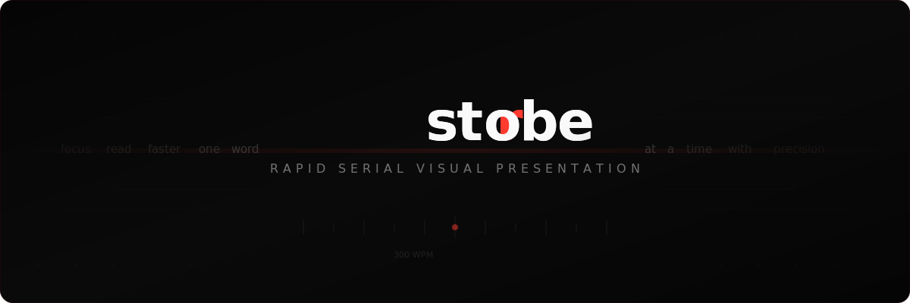

  

  
  
  
  

  A rapid-serial-visual-presentation reader for PDF and EPUB files. 
  One word at a time. Less eye movement. Tighter focus.

---

### One-Touch Flow
Hold to read, release to pause. Swipe to scrub through position.

### Precision Controls
Adjust reading speed from 100 to 1000 WPM, text size, and font — all without losing your place.

### Smart Timing
Pacing adapts to word length, sentence boundaries, and cognitive complexity so reading feels natural.

### ORP Highlighting
Each word is anchored at its Optimal Recognition Point so your eyes lock on instantly.

### PDF + EPUB Support
Import files from the system picker, drag and drop, or paste raw text for quick reads.

### Chapter Navigation
Jump between chapters with a full chapter list and progress tracking.

### 7 Font Choices
Curated typefaces tuned for single-word display and sustained reading comfort.

### Keyboard Shortcuts
Full keyboard control on Mac and iPad. Space, arrows, escape — no mouse required.

### Session Continuity
Strobe remembers your position, speed, and settings automatically across sessions.

---

### Privacy

Local by design. Your content and reading progress stay on-device. No accounts, no analytics, no cloud sync.

---

## Building

Open `Strobe.xcodeproj` in Xcode 15+ and build for iOS 17+ or macOS 14+.

## Documentation

- [GitHub Wiki](https://github.com/Cuzeth/Rapid-Serial-Visual-Presentation/wiki)
- Markdown docs: `wiki-md/`

## Contributing

Issues and pull requests are welcome. Keep changes focused, include tests when possible, and run the test suite before submitting.

## License

Licensed under the [Apache License, Version 2.0](LICENSE).
