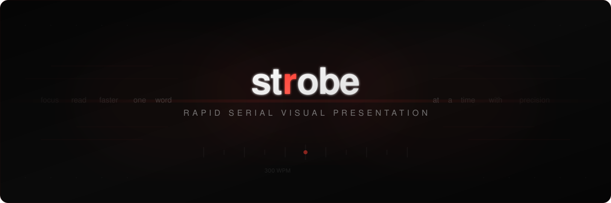
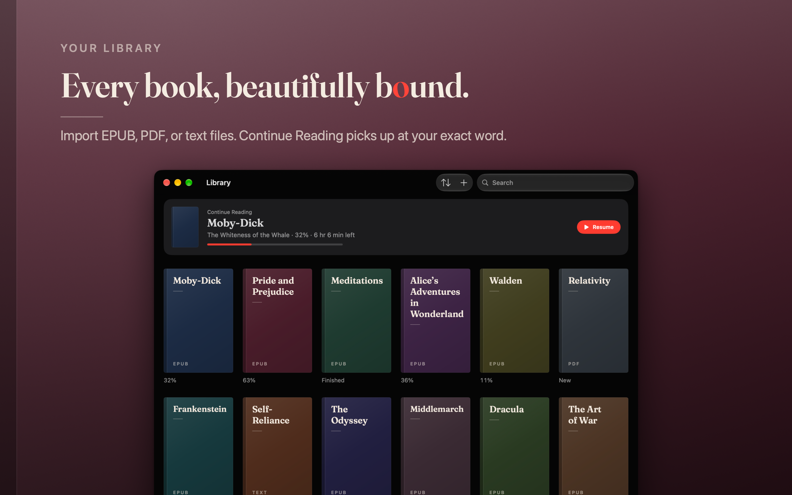

  

<h1 align="center">Read more. Move less.</h1>

  <b>Strobe</b> is a free, open-source speed reader for iPhone, iPad, and Mac.
  It shows your books, papers, and articles one word at a time, each in the same spot,
  so your eyes can stay still and your attention stays on the words.

  

  
  
  
  

  
  
  
  

## How it works

Reading a page keeps your eyes busy: hopping along every line, hunting for the start of the next one, finding your place again after every glance away. Strobe brings the words to you instead. Each one appears in the same spot, lined up on its red **Optimal Recognition Point**, so there's no line to follow and no place to lose. It's called **Rapid Serial Visual Presentation (RSVP)**, and it turns a wall of text into a steady stream.

Set any pace from **100 to 1,000 words per minute**. Start where you can follow comfortably and speed up as it clicks.

## Built for focused reading

### Hold to read. Let go to pause.

Press and hold anywhere on the screen to read, and lift your finger to stop. Slide up or down mid-sentence to change speed on the fly, and swipe sideways while paused to step word by word. Prefer hands-free? Turn off Hold to Read and tap to play instead.

### Pauses where a reader would.

Long words, acronyms, and hyphenated compounds get a little extra time. Sentence ends, commas, dashes, ellipses, and closing quotes each get their own pause, and you choose how long. Complexity timing lingers on rare words and names and breezes through the common ones, and an optional blank beat after each sentence gives you room to breathe.

### Never lose the thread.

Keep the previous and next words beside the one you're reading, and see an open quote or parenthesis hover above until it closes. Each new chapter shows its title as you reach it, so you always know where you are.

### The whole page, one tap away.

Open the full text with your place highlighted. Search for any word or phrase, jump between matches, and tap any word to pick up reading from there.

### Your words, your way.

Seven typefaces, from Fraunces to JetBrains Mono, at any size. Four text colors (Bright, Soft, Sepia, and Night) tone down the word and its red letter, and a true black background is made for reading in the dark. Every document remembers its own speed.

### Made for the keyboard.

On a Mac, or an iPad with a keyboard: <kbd>Space</kbd> reads and pauses, <kbd>←</kbd> <kbd>→</kbd> step through words, <kbd>Esc</kbd> goes back, <kbd>⌘N</kbd> starts a new text, and <kbd>⌘O</kbd> imports a file.

## Bring what you already read

  

Import EPUB, PDF, plain-text, and Markdown files from Files or with drag and drop, or paste in an article and see its word count and reading time before you start. Every book gets its own cover, the one you're reading waits at the top, and Strobe picks up at your exact word.

- **Chapters at a glance.** EPUB tables of contents and PDF bookmarks become chapters, each with its reading time at your speed.
- **Clean text.** Page numbers, running headers, and footers are stripped on import.
- **Not just English.** Chinese, Japanese, and Korean text is split into words automatically, and Arabic keeps its connected letterforms.

DRM-protected EPUBs and password-protected PDFs can't be imported.

## Private by design

**Your reading is nobody else's business.** No account, no ads, no analytics, no cloud. Strobe reads your files on your device and never sends them anywhere, and its App Store privacy label says so: **Data Not Collected**.

## Free and open source

Strobe costs nothing: no subscription, no in-app purchases, no ads. Every line of it lives in this repo under the Apache 2.0 license. If it earns a place in your reading routine, you can [support development on Buy Me a Coffee](https://buymeacoffee.com/cuzeth) or give the repo a star.

---

## Under the hood

Strobe is SwiftUI and SwiftData with no third-party dependencies.

- **Import:** EPUBs are unzipped and read from their package manifest, with chapters from nested tables of contents and a DRM check up front. PDFs bring their bookmarks along.
- **Tokenizer:** rejoins words hyphenated across line breaks, splits words joined by em dashes, keeps `10:30 PM` and `44 B.C.` in one piece, and segments CJK text with `NLTokenizer`.
- **Timing:** word length, punctuation, acronyms, compounds, and per-word complexity scores (computed once at import with the NaturalLanguage framework) all shape how long each word stays up.
- **Tests:** 500+ Swift Testing cases, run on an iOS simulator and on macOS in CI.

## Build it yourself

1. Open `Strobe.xcodeproj` in Xcode 27.
2. Pick the **Strobe** scheme and an iPhone, iPad, or Mac to run on.
3. To run on your own device or Mac, choose your team under **Signing & Capabilities**.

There are no packages to resolve and no API keys to add.

## Contributing

Issues and pull requests are welcome. Keep changes focused, include tests when you can, and run the test suite before opening a PR.

## License

Licensed under the [Apache License, Version 2.0](LICENSE).
