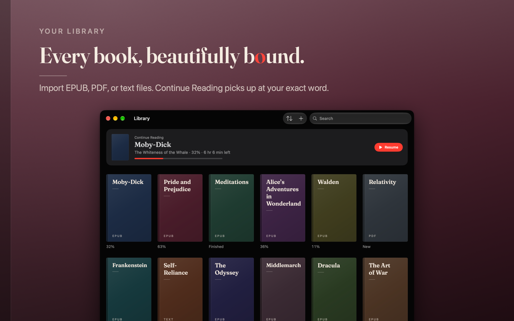

  

<h1 align="center">Read more. Move less.</h1>

  <b>Strobe</b> is a free, open-source speed reader for iPhone, iPad, and Mac.
  Read books, papers, and articles one word at a time, with adjustable speed,
  word timing, and a searchable full-text view.

  

  
  
  
  

  
  
  
  

## How it works

Strobe uses **Rapid Serial Visual Presentation (RSVP)** to display words in sequence. Each word aligns on a highlighted letter, called the **Optimal Recognition Point**, at a fixed position on the screen.

Set the pace from **100 to 1,000 words per minute** and adjust it while you read.

## Built for focused reading

### Hold to read. Let go to pause.

Press and hold anywhere on the screen to read, and lift your finger to stop. Slide up or down mid-sentence to change speed on the fly, and swipe sideways while paused to step word by word. Prefer hands-free? Turn off Hold to Read and tap to play instead.

### Adjustable word timing

Add time for long words and choose pause lengths for sentence ends, commas, dashes, ellipses, and closing quotes. Acronyms and hyphenated compounds receive extra time automatically. Complexity Timing adjusts for common words, rare words, and names. You can also add a blank interval between sentences.

### Context and chapter titles

Keep the previous and next words beside the one you're reading, and see an open quote or parenthesis hover above until it closes. Each new chapter shows its title as you reach it.

### The whole page, one tap away.

Open the full text with your place highlighted. Search for any word or phrase, jump between matches, and tap any word to pick up reading from there.

### Fonts and text colors

Choose from seven typefaces, including Fraunces and JetBrains Mono, with adjustable text size. Four text colors (Bright, Soft, Sepia, and Night) tone down the word and its red letter, and a true black background is made for reading in the dark. Every document remembers its own speed.

### Made for the keyboard.

On a Mac, or an iPad with a keyboard: <kbd>Space</kbd> reads and pauses, <kbd>←</kbd> <kbd>→</kbd> step through words, <kbd>Esc</kbd> goes back, <kbd>⌘N</kbd> starts a new text, and <kbd>⌘O</kbd> imports a file.

## Bring what you already read

  

Import EPUB, PDF, plain-text, and Markdown files from Files or with drag and drop, or paste in an article and see its word count and reading time before you start. Every book gets its own cover, the one you're reading waits at the top, and Strobe picks up at your exact word.

- **Chapters at a glance.** EPUB tables of contents and PDF bookmarks become chapters, each with its reading time at your speed.
- **Clean text.** Page numbers, running headers, and footers are stripped on import.
- **Not just English.** Chinese, Japanese, and Korean text is split into words automatically, and Arabic keeps its connected letterforms.

DRM-protected EPUBs and password-protected PDFs can't be imported.

## Private by design

Strobe processes documents and stores your library on your device. It requires no account and includes no ads or analytics.

## Free and open source

Strobe is free, with no subscription or in-app purchases. The source is available under the Apache 2.0 license. If it earns a place in your reading routine, you can [support development on Buy Me a Coffee](https://buymeacoffee.com/cuzeth) or give the repo a star.

---

## Under the hood

Strobe is SwiftUI and SwiftData with no third-party dependencies.

- **Import:** EPUBs are unzipped and read from their package manifest, with chapters from nested tables of contents and a DRM check up front. PDFs bring their bookmarks along.
- **Tokenizer:** rejoins words hyphenated across line breaks, splits words joined by em dashes, keeps `10:30 PM` and `44 B.C.` in one piece, and segments CJK text with `NLTokenizer`.
- **Timing:** word length, punctuation, acronyms, compounds, and per-word complexity scores (computed once at import with the NaturalLanguage framework) all shape how long each word stays up.
- **Tests:** 500+ Swift Testing cases, run on an iOS simulator and on macOS in CI.

## Build it yourself

1. Open `Strobe.xcodeproj` in Xcode 27.
2. Pick the **Strobe** scheme and an iPhone, iPad, or Mac to run on.
3. To run on your own device or Mac, choose your team under **Signing & Capabilities**.

There are no packages to resolve and no API keys to add.

## Contributing

Issues and pull requests are welcome. Keep changes focused, include tests when you can, and run the test suite before opening a PR.

## License

Licensed under the [Apache License, Version 2.0](LICENSE).
